# BizTrack — what you can change on the day

**A guide for the panel presentation · 6 August 2026**

One question, answered six times: **for each feature, what can you change while the panel is
watching, and what would need us to change the software?**

Everything below was taken from the live system on the day. Every picture is a real screen.

---

## Before you start — three sentences that save you

**1. Some things are the law. Some things are our choice. Never mix them up.**
The 3, 7 and 20 working-day processing limits are Republic Act 11032. They are not settings and
they are not ours. If someone asks you to change them, the answer is *"that is the statute"* — not
*"we can't"*. Everything else on these screens is a decision we made, and the honest answer for
most of it is *"we chose that; changing it means changing the software"*.

**2. There is a real open question, and it is better if you raise it than if they do.**
The law says a simple filing gets 3 days, a complex one 7, a highly technical one 20. The law does
not say which of your filings is which. **That mapping is ours, and BPLO has not approved it.**
Details in Feature 1 below. Say it before you are asked.

**3. Do not offer to change how many bars or lines the ranked charts show.**
The dashboard shows five barangays and five business categories. The growth screen shows six
barangays and six industries. Both numbers are built in, and neither moves cleanly: the dashboard
headings spell the number out as a word — *"Top **Five** Barangays"*, *"**Five** of 21 barangays"*
— and the growth chart has exactly six ways of drawing a line. Change the number and you would get
ten bars under a heading that still said five, or ten lines in six repeating colours. It is a
small piece of work and it is not a live one. Say *"that is a change, not a setting"* and move on.

### What can be changed without touching the software at all

These are not on the screens — they need somebody with access to the server, but no rebuild:
turn real email on or off, point the statistics engine somewhere else, change how long the system
waits before calling last night's figures stale. Useful to know exists. Not worth volunteering.

### And when we say "code change and redeploy", what that actually costs

Changing any figure that feeds a calculation also means re-running the reference results that our
two calculation engines are checked against, so the numbers still agree to six decimal places. It
is a same-week job, not a same-minute one. That check is deliberate, and it is the reason nothing
here can silently drift.

---

# Feature 1 · Analytics Dashboard

*Who uses it: BPLO*

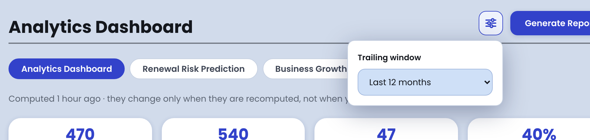

## You can change this live

**The window everything is measured over.** The small slider icon at the top right of the page,
just to the left of the blue *Generate Report* button. Click it and one field appears — *Trailing
window*. It offers the **last 3, 6, 12, 24 or 36 months**. Pick one and every chart on the page
redraws against it.

All five of those windows are worked out ahead of time overnight, so all five come back
immediately. This is safe to demonstrate.

**Recompute on the spot.** *Refresh now*, under the page title, next to the line that says when
the figures were last computed.

**Explain any number.** The small circled **i** beside every panel heading opens a plain-English
definition of that measure. If a panelist asks *"what exactly do you mean by compliance rate?"*,
open it and read it out.

## This is fixed

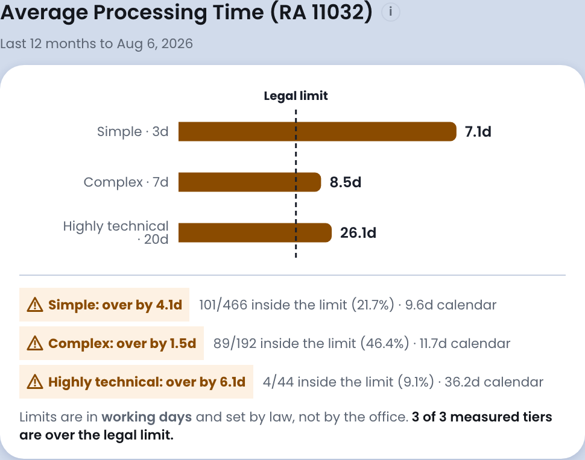

**The 3, 7 and 20 working-day limits — that is the statute.** RA 11032, the Ease of Doing Business
Act. The dashed line on this chart is the legal limit, not a service target we set. We measure
against it; we do not choose it. Weekends are excluded because the law counts in working days.

**Which filing counts as simple, complex or highly technical — that one is ours, and it is not yet
approved.** Today the system treats renewals and amendments as *simple*, new registrations as
*complex*, and a new registration as *highly technical* only when it declares manufacturing,
contracting or an amusement place **and** declares capital of at least one million pesos.

That rule is our invention. The Citizen's Charter should say which filing sits in which tier and
we have not been given it. It matters, because this entire compliance chart is measured against
that mapping — classify a filing into the wrong tier and an office is reported as breaching a
deadline it never had. It is on our open-questions list for BPLO. Changing it needs a code change
and a redeploy.

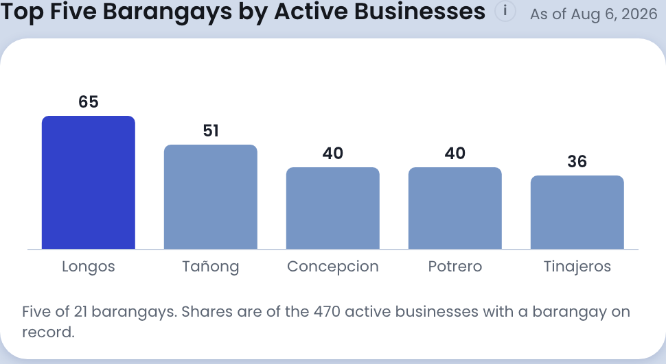

**Five bars, and the word "Five" in the heading.** Both ranked charts show exactly five. The
number is built in, and it is also written out as an English word in the heading and twice in the
sentence underneath. Changing it is a code change *plus* a rewording. Do not offer it live.

**Also built in, each for a reason:**

- The expiry panel counts permits due in **30, 60 and 90 days**. Those three steps are fixed.
- Inspections are labelled sanitary, fire safety or zoning **by which office carried them out**,
  because the inspection record does not yet carry its own type. That is a gap in the data, not a
  setting — the proper fix is to record the type, and it is on the list.
- The map draws up to **1,000** businesses before it stops adding points.
- Rates are rounded to one decimal place everywhere.

## If they ask X, say Y

**"Can I see the last three years?"**
Yes. *(Open the selector, choose Last 36 months, let it redraw in front of them.)*

**"Why only five barangays? Show me ten."**
Five is what the specification asks for and what the headings on this chart say in words. Showing
ten is a change to the software, not a setting — we would have to reword the headings too. It is a
small change and we would make it.

**"Are you meeting the legal processing times?"**
No, and the chart says so honestly — all three tiers are currently over. Those limits are set by
RA 11032. Our job is to show the office where it stands against them, which is what this panel
does.

**"Who decided that a manufacturer with a million pesos is highly technical?"**
We did, provisionally, so the report could be built. The law sets the clocks; it does not sort
filings into them. That sorting should come from Malabon's Citizen's Charter, and it is an open
item we have flagged to BPLO. If the answer differs from our working rule, this chart changes.

---

# Feature 2 · Renewal Risk Prediction

*Who uses it: BPLO*

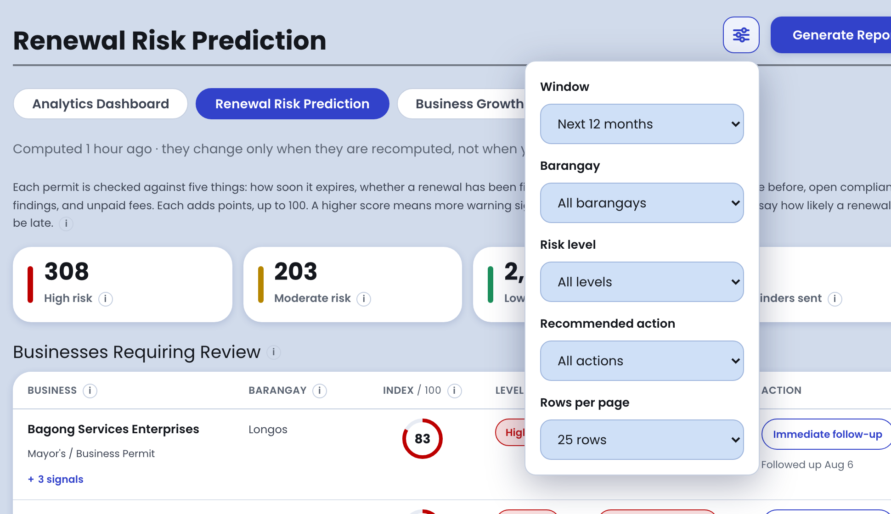

## You can change this live

This screen has more live control than any other. One click on the filter icon at the top right
opens **five** menus:

- **Window** — the next 30, 60 or 90 days, or the next 6 or 12 months
- **Barangay** — any barangay on the register, or all of them
- **Risk level** — all, high, moderate or low
- **Recommended action** — all, immediate follow-up, send reminder, or monitor
- **Rows per page** — 25, 50 or 100

Plus *Previous* and *Next* at the foot of the list.

**An officer can also act from this screen, live:** the *Immediate follow-up* button on any row
sends that business a message about that permit. Once a day per permit, so an eager officer cannot
send the same person the same chase six times.

*(Worth knowing, not worth volunteering: only the unfiltered views at 25 rows are computed
overnight. Apply a filter and the answer is worked out on the spot — same figures, a moment
slower, and the screen says which engine produced them.)*

## This is fixed

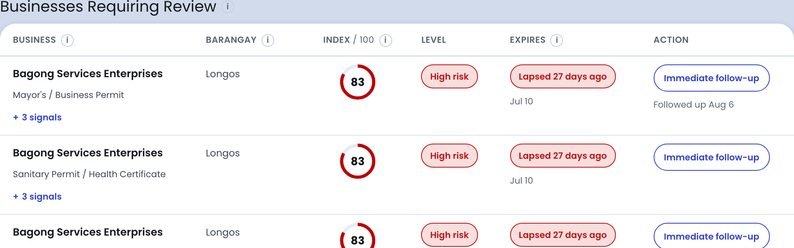

**The score itself.** Each business is measured on five signals, and the weights are fixed and add
up to 100:

- how soon the permit expires — **30**
- how far a renewal has actually got — **25**
- whether that business has renewed on time before — **20**
- open inspection findings — **15**
- unpaid fees — **10**

**Where the levels sit.** 50 and above is high risk, 25 to 49 is moderate, below that is low.
Built in.

**The steps inside each signal.** A permit expiring tomorrow scores full marks on the expiry
signal; one expiring in three months scores almost nothing. Those steps are built in.

**Three reasons per row.** The *+3 signals* link under each business opens the three strongest
reasons for that score. Three is built in.

**The colour of the expiry chip** — red within a week, amber within a fortnight, yellow within a
month — is set separately from the reminder schedule in Feature 3, and the two would need changing
together.

**The good news to say out loud:** these numbers live in one place and are handed to the
statistics engine rather than written twice, so the two cannot disagree. It is still a code change
and a redeploy.

## If they ask X, say Y

**"Show me only the high-risk businesses in Catmon."**
Yes. *(Open the filter icon, set Risk level to High, set Barangay to Catmon.)*

**"Why is expiry worth 30 points and unpaid fees only 10?"**
Deliberate. The expiry date is the only thing that makes a lapse certain — everything else is a
warning sign. An unpaid fee is a nudge; a date is a deadline. The five weights add to 100 and each
one has a written reason behind it. Changing them is a code change.

**"Is this a real prediction, or just a checklist?"**
It is a transparent scoring rule, on purpose. Every row shows the reasons behind its own score, so
an officer can check the machine's work and defend the decision to a business owner. A black box
would be the wrong thing for a government file.

**"Can I see all 300 at once?"**
100 a page is the largest option. Beyond that, use *Next*.

---

# Feature 3 · Notifications

*Who uses it: the business owner*

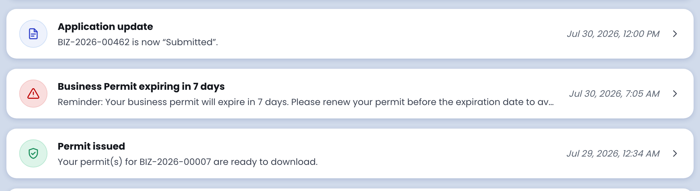

## You can change this live

**Nothing about when reminders are sent.** There is no notifications settings screen and no
dropdown. Owners receive what the rules send. Say that plainly — it is a deliberate design, not an
omission: reminder timing is policy, and policy should not be editable by whoever is logged in.

What a person *can* do on this screen is read a notice and mark everything as read. And an officer
can send a follow-up to one specific business from the risk watchlist — see Feature 2.

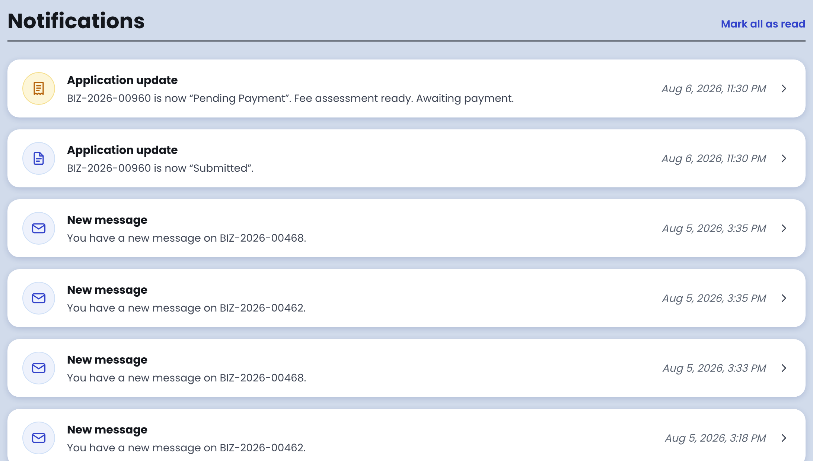

## This is fixed

**The reminder ladder: 30 days, 15 days, 7 days and 1 day before the permit expires.** Four
notices, each sent once, each escalating. That is what the specification asks for and it is built
in.

**Once a night.** The system checks every permit shortly after midnight; the analytics screens
recompute at 3 a.m. Both times are built in.

**One notice per permit per kind, ever.** A re-run cannot double-send. That is enforced in the
database, not by a setting.

**Silence after 30 days lapsed.** A permit that expired more than a month ago is corrected quietly
and no message goes out. This is what stops a couple of thousand old records landing in real
inboxes the first time the job runs. It is a deliberate safety valve.

**The wording of every message.** Built in.

**Email is in simulation today.** Every message is composed and recorded, but delivery is switched
to a log file so testing does not mail real business owners. Switching it on is a server setting —
no code change — but it does need somebody on the server.

**SMS is a demonstration.** It writes to a file. Sending real text messages means connecting a
telco provider, and that is a build, not a switch.

## If they ask X, say Y

**"Can you add a 60-day reminder?"**
Not today. There are four steps — 30, 15, 7 and 1 day — and they are built in. Four was a
deliberate limit: every extra step is one more message to every permit holder in the city, and a
reminder people stop reading is worse than no reminder. Adding a fifth is a code change.

**"Are these real emails going out?"**
Not yet. The system writes every message it would send, and you can see them all here. Delivery is
in simulation for the demo so nobody's real inbox gets test mail. Turning it on is a setting, not
a rebuild.

**"What happens to all the permits that expired in 2024 — do they all get spammed?"**
No. Anything more than 30 days past expiry is corrected silently, with no message. That was built
in exactly to prevent it.

**"Can an officer chase a specific business?"**
Yes, live, from the renewal risk watchlist. Once a day per permit, so an eager officer cannot send
the same person the same chase six times.

---

# Feature 4 · Business Growth Analysis

*Who uses it: BPLO*

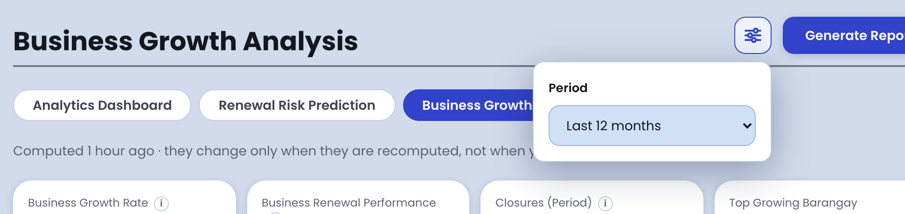

## You can change this live

**The period.** Same slider icon, top right, beside *Generate Report*. One field, *Period*: the
**last 3, 6, 12, 24 or 36 months**. Everything on the page recalculates.

That is the only live control on this screen.

## This is fixed

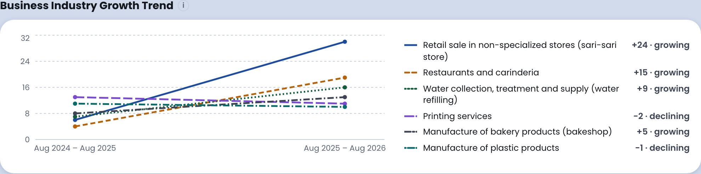

**Six industries, and six line colours.** The number of industries shown is built in — and so is
the fact that the chart has exactly six ways of drawing a line. Ask for ten and four of them would
be drawn in colours already in use. This is one to say plainly: *"six is built in, and the chart
was designed for six."*

**What this chart actually ranks — read this before you present it.**

The panel is titled *Business Industry Growth Trend*, but the six industries on it are the six
**largest** industries on the register, not the six fastest-growing. Each line then shows honestly
how that industry moved, which is why two of the six are labelled *declining* on a panel about
growth.

That is the truthful description: **it shows the trend of the largest industries.** Say it that
way, in those words. Do not let the panel title do the talking for you.

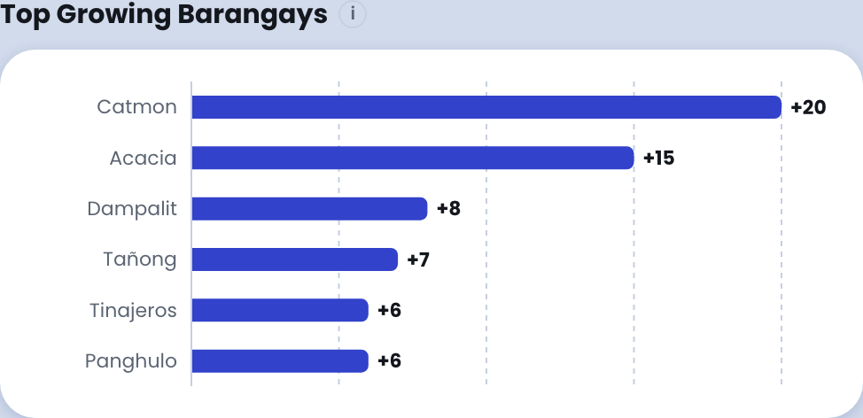

**And the panel beside it does rank by growth.** Top Growing Barangays is ordered by how much each
one moved — Catmon up 20, Acacia up 15. So the two ranked panels on this screen answer two
different questions. That is a fair criticism, it is worth acknowledging, and fixing it is a code
change in two places plus re-running the reference figures.

**Also built in:**

- A renewal counts as missed **30 days** after expiry, not on the day.
- A permit ending 31 December replaced by one starting 1 January counts as unbroken cover.
- Only the mayor's business permit defines a renewal cycle; the clearances do not.
- The survival figure always carries the sentence explaining how it was calculated — deliberately
  fixed, so the number cannot be exported without its method.

## If they ask X, say Y

**"Which industries are growing fastest?"**
This chart does not answer that, and I want to be straight about it. It takes the six biggest
industries in Malabon and shows how each of them has moved. Sari-sari stores are up 24,
restaurants up 15; printing and plastics are down. If you want the six fastest movers regardless
of size, that is a change we would make — but it is a change to the software, in two places, so
not today.

**"Show me the top ten industries."**
Six today. The chart also only has six ways of drawing a line, so ten would need four more that
stay distinguishable in black-and-white print and to a colour-blind reader. That is a piece of
work, not a setting.

**"Why does the barangay chart rank by growth and the industry chart by size?"**
Because the specification asks the barangay panel for movers and the industry panel for the
standing picture. You are right that both sitting under one heading reads oddly — we would align
them.

---

# Feature 5 · Business Location Insights

*Who uses it: the business owner, while applying*

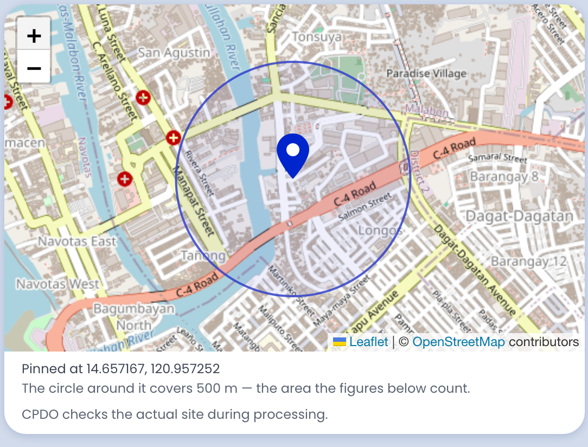

This appears inside the application form, on the *Location & Zoning* step, the moment the
applicant drops a pin. The circle you can see is the 500-metre ring, and the sentence under the
map names it.

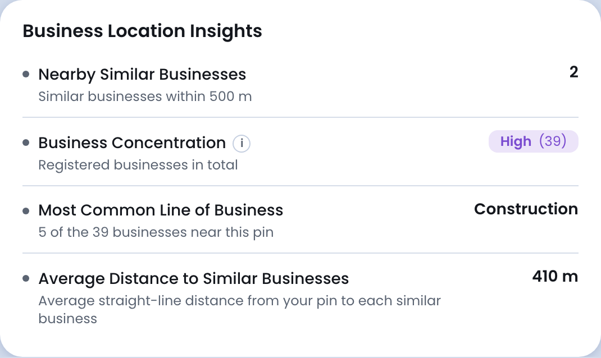

## You can change this live

**Only where the pin is.** Move the pin and all four figures recalculate within a second. There is
no radius control on this screen, no dropdown, and no way to ask for a different circle.

That is worth stating positively: the applicant's only input is the one thing they actually know —
where their shop is.

## This is fixed

**500 metres — and this is the one to be honest about.**

We chose it. It is not a planning standard, it is not in the law, and no agency handed it to us.
It is roughly a five-minute walk, and it is about the distance inside which a small retailer
actually competes for the same customers. We wrote it into our own specification and the system
follows it. **Changing it needs a code change and a redeploy.**

The good news to offer alongside that: the figure lives in exactly one place. The ring on the map
and every sentence on the panel read it from the same source, so on the day it does change,
nothing anywhere is left saying 500.

**The Low / Medium / High scale.** 0 to 5 businesses nearby is *Low*, 6 to 10 is *Medium*, 11 or
more is *High*. Straight from the specification, and built in.

**The industry names.** The numbering behind them is the national Philippine Standard Industrial
Classification and is not ours to change. The plain-English names shown to the applicant *are*
ours — we rewrote them because the official wording caused a real misreading once — and changing a
name is a code change.

**Distances are straight-line, not walking distance.** So "410 m away" means 410 metres across the
map, not along the street.

**This panel is calculated by the application itself**, not by the overnight statistics run. That
is deliberate: a pin dropped five seconds ago cannot be in last night's figures. Everything it
does is a count, a distance and an average, so there is nothing hidden in it.

## If they ask X, say Y

**"Why 500 metres?"**
Our choice. It is roughly a five-minute walk and it is the distance inside which a small retailer
genuinely competes. It is not a legal or a planning standard — we set it in our own specification.
We can change it, but that is a change to the software, not a setting on the screen.

**"Can it be different per industry — 500 metres for a sari-sari store, two kilometres for a
warehouse?"**
Not today. It is one distance for everything. That is a fair point and a sensible improvement, and
it is on our list.

**"Is eleven businesses really 'High'?"**
For a 500-metre circle in a city as dense as Malabon, yes — that is the scale in the
specification. Nought to five Low, six to ten Medium, eleven or more High. Built in.

**"Does this stop somebody opening there?"**
No. It is advice, shown to the applicant while they are still choosing. Zoning is checked
separately by the planning office, and the note under the map says so.

---

# Feature 6 · Permit Processing Time Monitoring

*Who uses it: the super admin*

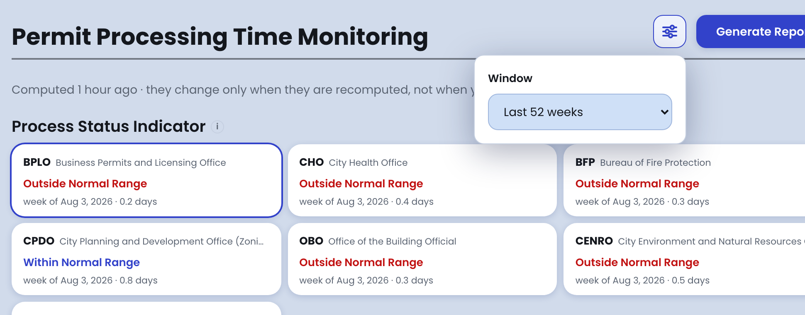

## You can change this live

**The window.** Filter icon, top right. One field, *Window*: the **last 13, 26, 52 or 104 weeks**.

**Which office the chart is about.** The seven cards across the top of the page are buttons. Click
BPLO, CHO, BFP, CPDO, OBO, CENRO or the market office and the chart below redraws for that office.
This demonstrates well — it is one click and the whole page follows.

**Recompute on the spot.** *Refresh now*, under the title.

## This is fixed

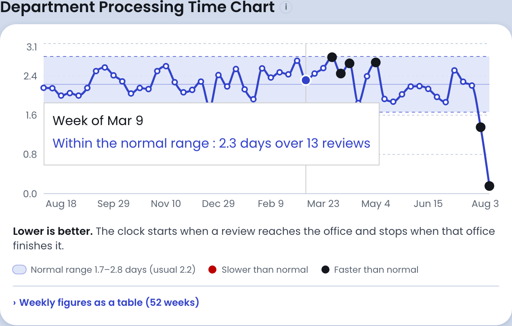

**What counts as "normal" is fitted on the first 24 weeks of the window and then held.** That is
built in, and it is the most defensible number on this screen: if we refitted the normal band on
all the data, an office that got gradually worse would keep looking normal forever, because the
band would widen to follow it. Fixing the band early is the whole point of the chart.

It is also why the page opens on 52 weeks — a 26-week window would leave almost nothing under
observation once the first 24 weeks were used up.

**Weeks with fewer than three finished reviews are dropped.** Built in. That is why a quiet office
shows a note instead of a line: we would rather say "not enough work that week" than draw a trend
through a single file.

**The width of the normal band** is three standard deviations, which is the standard for this kind
of chart and matches what the statistics package does. Not ours to invent.

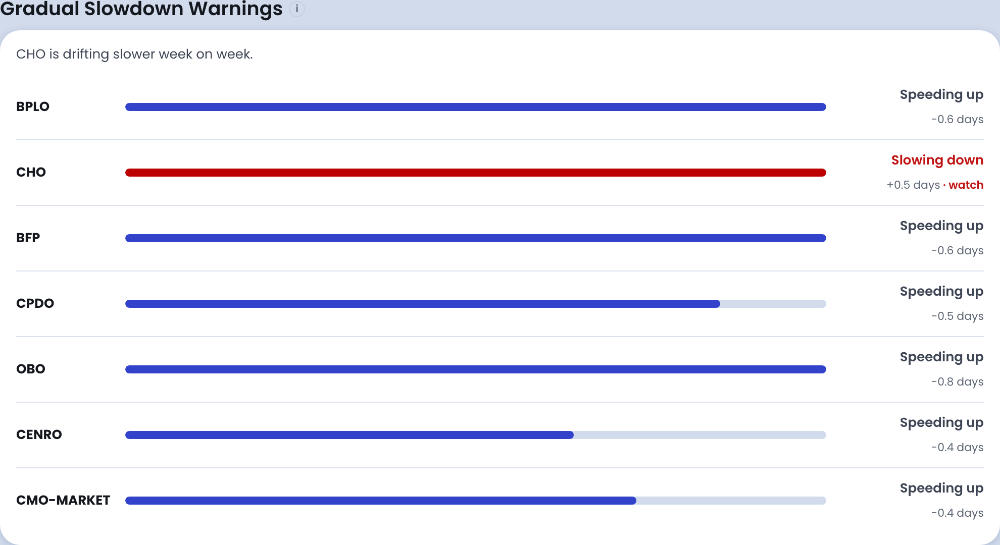

**The half-a-day cut-off** that decides whether an office reads as *speeding up*, *slowing down*
or *steady*. Built in. CHO is at +0.5 days here, which is exactly why it is flagged.

**The 3, 7 and 20 working-day limits** used on the compliance side of the report — statute again,
same as Feature 1.

**The seven offices themselves** are built in.

## If they ask X, say Y

**"Show me two years."**
Yes. *(Open the window selector, choose Last 104 weeks.)*

**"Why does that office have no chart?"**
Because it did not finish enough reviews per week to draw an honest line. We drop any week with
fewer than three completions rather than plot a trend through one or two files, and we say so on
the screen instead of leaving a gap.

**"Why is the normal range set on the first six months instead of all the data?"**
So a slowdown cannot move the goalposts. If the band were refitted on everything, an office that
was steadily getting worse would widen its own band and never trip an alert. Fixing it early is
what makes the alert mean something.

**"Is CHO in breach of the law?"**
Different question. This chart is about each office against its own normal — *slowing down* means
slower than its own recent past, not slower than the legal limit. Compliance against the 3, 7 and
20 working-day limits is on the Analytics Dashboard.

**"Can you set a target of two days for BPLO?"**
Not on this screen. This chart has no targets in it by design — it shows what the office actually
does and flags when that changes. Targets against the law are on the dashboard.

---

# One page to keep in your hand

**Say yes immediately to:** any time window on any of the four staff screens; the five filters on
Renewal Risk; which office the processing-time chart is about; moving the pin on the map.

**Say "that is the statute" to:** 3, 7 and 20 working days. Weekends excluded.

**Say "we chose that, and changing it is a change to the software" to:** the 500-metre circle; the
Low / Medium / High scale; the five risk weights; six industries and five barangays; the 30 / 15 /
7 / 1-day reminders; the 24-week calibration; the three-completions-a-week floor.

**Raise it yourself before they do:** which filings count as simple, complex or highly technical is
our rule and BPLO has not approved it.

**Answer this one carefully:** the industry chart on the growth screen shows the trend of the
**largest** industries, not the fastest-growing ones.

**Do not offer live:** changing how many barangays, categories or industries the ranked charts
show. The headings spell the number out in words and the chart has exactly six colours.

*Prepared 6 August 2026. Every screenshot in this guide was taken from the live system on the day.*
